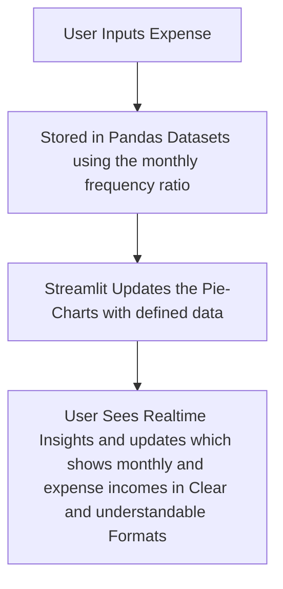

# Expense Tracker

> 🚀 **Your personal finance sidekick — track, analyze, and dominate your spending habits. Built with Python + Streamlit.**

---

<div align="center">
  
  
<!--  
   
  -->
</div>

---

## What Exactly is Expense-Tracker?

**Expense-Tracker** is a sleek, interactive app for tracking your income and expenses, built entirely in **Python** with a **Streamlit** frontend. <!-- Whether you're a student, a freelancer, or a cryptobro trying to understand where your ETH went — we got you. 💁‍♂️ -->

---

## Features

✅ Add income and expenses with ease  
📊 Real-time analytics and spending summaries  
📅 Filter by date, category, and tags  
💾 Data saved locally (or extend to cloud!)  
📈 Pie charts to visualize where your money’s going  
🧠 Super clean UI developed with Streamlit  
🔐 Privacy-respecting — your data stays on your machine using Space/Cost-Effective methods 

---

## UI Preview
No Preview was provided for visualistaion.
<!--
> ✨ Because who doesn't love a good visual?


-->
---

## Installation

```bash
# 1. Clone the repo
git clone https://github.com/your-username/Expense-Tracker.git
cd Expense-Tracker

# 2. Install dependencies
pip install -r requirements.txt

# 3. Run the app
streamlit run app.py
```

---

## Built With

| Tech        | Purpose                     |
|-------------|-----------------------------|
| 🐍 Python    | Backend logic               |
| 🎈 Streamlit | UI/UX and interaction       |
| 📊 Matplotlib / Plotly | Data visualization |
| 🗃️ Pandas    | Data processing & handling |

---

## How It Works


<!--
---

## 🤖 Future Plans

- ☁️ Cloud sync with Firebase or Supabase  
- 📲 Mobile responsiveness  
- 🧠 ML-based budget suggestions  
- 🗃️ Export to CSV, Excel, PDF  
- 🔔 Weekly email summaries (Mailchimp or SMTP)
-->
---

## Contributing
Here's how to contribute:

1.  Fork the repo
2.  Create a new branch
3.  Commit your changes
4.  Open a pull request

---

##  Project Maintainers
**This projects is maintaned by Your's Truely..**
👨‍💻
- **[@Nafisat](https://github.com/U22CS1004) – 💾 Data Handler.** 
- **[@Muhammed](https://github.com/Moh-dakai) – 🧠 Core Backend Engineer.**
- **[@Eseoghene](https://github.com/Eseoghene-ChristineOtuaga) – 📊 Streamlit UI and User Interaction Manager.**  
- **[@Favour Diamond](https://github.com/Favour-D) – 📅 Technical and Summary Reporter.** 
- **[@Collins](https://github.com/Contractor-x) – Github Documentation and Release Manager.** 
---

## Contact

For questions, collabs, or fan mail:

> Hit any Project Maintainer up. and we will respond in a Jiffy..
<!--📧 your.email@example.com  
🔗 [LinkedIn](https://linkedin.com/in/your-profile)  
🐙 [GitHub](https://github.com/your-username)-->

---

## Star this repo
    If you really found this helpful...
<!--If this helped you or saved you from financial doom, --> 
Smash that ⭐ button. It helps more than you think!

---

## 📄 License

MIT License © [Expense-Tracker] 2025

---
